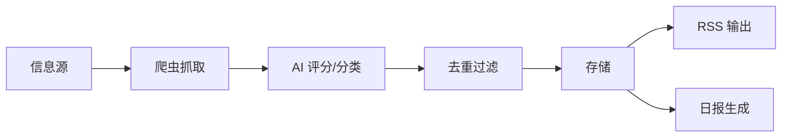

# 第 2 章：定义 MVP 和功能拆分

---

## MVP 定义

上一章确定了核心需求，这里把它转化成可执行的功能清单。

**MVP 的目标：** 跑通一条完整链路 — 抓取 → 评分 → 分类 → 输出 RSS。

不需要好看，不需要完善，只需要每天能产出一份我自己能用的 AI 信息源。

---

## 功能拆分

### must_have（不做就没法用）

| 功能 | 具体描述 | 验收标准 |
|------|----------|----------|
| 信息源接入 | 至少接 3 个源：arXiv、GitHub、HackerNews | 能定时抓到数据 |
| AI 评分 | 用大模型给每条新闻打分 | 7 分以上留下，7 分以下丢弃 |
| 智能分类 | 按主题归类（工具/论文/行业/社区）| 每条新闻有明确分类 |
| RSS 输出 | 生成标准 RSS 2.0 feed | 能被 RSS 阅读器正常订阅 |
| 定时执行 | 每天自动跑一次 | 不需要手动触发 |

### should_have（做了更好）

| 功能 | 具体描述 |
|------|----------|
| 每日日报 | 生成一份结构化的今日摘要 |
| 去重 | URL + 标题 + 语义三重去重 |
| Web 页面 | 简单的 HTML 页面展示日报 |

### nice_to_have（后面再说）

| 功能 | 具体描述 |
|------|----------|
| 语音播报 | TTS 生成播报音频 |
| 邮件推送 | 每天早上发一封日报邮件 |
| Webhook | 推送到企业微信/飞书 |

---

## 数据流设计

在动手写代码之前，先想清楚数据怎么流：

这条链路很清晰，每个环节职责单一。这是 MVP 阶段最重要的 — **链路简单、职责清晰、容易调试**。

---

## 数据源选择

选信息源的标准：

1. **有 API 或可爬** — 不用登录、不用破验证码
2. **AI 领域相关** — 不是泛科技，是聚焦 AI
3. **更新频率高** — 每天有新内容

最终选了（按实际配置）：

| 信息源 | 获取方式 | 数量 | 内容 |
|--------|----------|------|------|
| RSS 源 | 标准 RSS 订阅 | 9 个 | OpenAI/Anthropic/Google/DeepMind/HuggingFace/MIT TR/The Verge |
| HackerNews | API | 1 个 | Top Stories，min_score ≥ 100 |
| Reddit | API | 5 个子版 | MachineLearning/LocalLLaMA/OpenAI/ClaudeAI/artificial |
| GitHub Trending | API | 1 个 | AI/ML 主题日榜，min_stars ≥ 150 |
| arXiv | API | 1 个 | cs.AI + cs.CL + cs.LG，48 小时窗口 |

**总计 18 个信息源。** 但 MVP 阶段不需要一步到位 — 先接 HackerNews + 几个 RSS 跑通链路，确认可用后再逐步加。

---

## AI 评分机制

这是产品的核心差异化 — 不是把所有信息都堆给用户，而是帮用户筛。

评分设计：

- **模型：** 智谱 GLM（国产、API 便宜、中英文都行）
- **输入：** 新闻标题 + 摘要
- **输出：** 1-10 分 + 分类标签
- **阈值：** 7 分以上才入库

为什么是 7 分？试了几轮发现 7 分是一个比较好的平衡点 — 太高会漏掉有价值的内容，太低会引入噪音。

---

## 开发节奏

有 WeChat RSS 项目的底座在前，开源版的开发速度比从零开始快很多：

- 数据模型、定时任务、API 路由的模式可以直接复用
- AI 协作写代码，具体实现细节不用自己一行行写
- 核心链路（抓取 → 分析 → 存储 → 输出）逻辑清晰，不需要反复设计

**经验：前一个项目的积累是后一个项目最大的加速器。** 不只是代码复用，更是模式复用 — 你知道什么地方该怎么做，不会在选型和架构上纠结。

---

## 避坑经验

回头看这个阶段的决策，有几个点值得说：

**1. 不要一上来就接所有数据源**

我见过有人第一天就想接 10 个源。结果爬虫维护成本飙升，还没等产品跑起来就被源站封了。先 3 个，跑通了再加。

**2. AI 评分不要追求完美**

7 分阈值不一定最优，但够用。先跑起来看效果，再调参数。方法论里说的"完美是敌人"在这里体现得很明显。

**3. MVP 不要做前端**

开源版的"前端"就是两个静态 HTML 文件 + RSS feed。用户是我自己，RSS 阅读器才是真正的前端。

