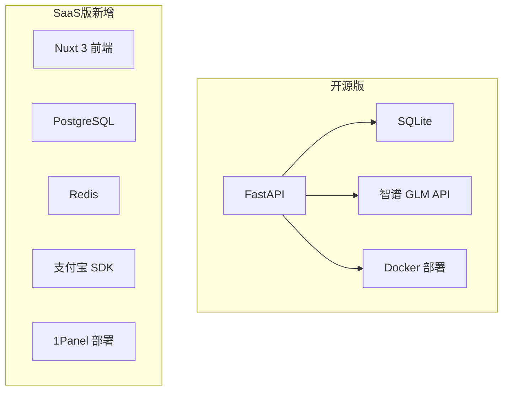

# 第 3 章：技术选型决策

---

## 选型原则

技术选型不是选"最好的"，是选**当前阶段最合适的**。

对这个项目来说，合适意味着：

1. **我熟悉** — 不想花时间学新框架，目标是出产品
2. **AI 能帮我写** — 主流技术栈 AI 写代码质量更高
3. **部署简单** — 单机 Docker 能跑，不依赖复杂基础设施
4. **成本低** — 个人项目，能省则省

---

## 后端：Python + FastAPI

| 候选 | 优势 | 劣势 | 结论 |
|------|------|------|------|
| Python + FastAPI | 异步、类型提示、AI 生态好 | 性能不如 Go | 选这个 |
| Node.js + Express | 前后端统一 | Python AI 库更丰富 | 不选 |
| Go + Gin | 性能好 | 写起来啰嗦，AI 库少 | 不选 |

**选 FastAPI 的理由：**

- **异步原生** — 爬虫和 AI 调用都是 IO 密集，async/await 天然适合
- **类型提示** — Pydantic 模型让 AI 写代码时出错率低
- **我熟** — WeChat RSS 也是 FastAPI，代码模式可以复用
- **AI 友好** — ChatGPT/Claude 对 FastAPI 的代码生成质量很高

---

## 数据库：SQLite（开源版）→ PostgreSQL（SaaS 版）

### 开源版用 SQLite

| 理由 | 说明 |
|------|------|
| 零配置 | 不需要装数据库服务，一个文件搞定 |
| 够用 | 单用户场景，每天几百条新闻，SQLite 绰绰有余 |
| 迁移方便 | 数据就是一个 `.db` 文件，备份/迁移直接复制 |

### SaaS 版换 PostgreSQL

| 理由 | 说明 |
|------|------|
| 多用户并发 | SQLite 单写锁，多用户同时写会冲突 |
| 查询性能 | 用户量上来后需要索引和复杂查询 |
| 生态 | 和 Redis 配合做缓存/限流 |

**经验：不要一上来就用 PostgreSQL。** 开源版用 SQLite 让部署门槛降到最低 — `docker-compose up` 就能跑，不需要用户自己装数据库。

---

## AI 模型：智谱 GLM

| 候选 | 价格 | 中文能力 | 稳定性 | 结论 |
|------|------|----------|--------|------|
| OpenAI GPT | 贵 | 一般 | 需要翻墙 | 不选 |
| 智谱 GLM | 便宜 | 好 | 国内直连 | 选这个 |
| 通义千问 | 便宜 | 好 | 国内直连 | 备选 |

**选智谱 GLM 的理由：**

- **国内直连** — 不需要代理，部署在国内服务器无障碍
- **价格便宜** — 累计消耗 13M Token，成本几块钱
- **中文好** — 新闻分析涉及中英文混合，GLM 处理得不错
- **API 兼容 OpenAI 格式** — 后续想换模型几乎零成本

---

## 部署：Docker

这个没什么好纠结的。个人项目 Docker 化是标配：

- 环境一致性 — 本地能跑，服务器就能跑
- 一键部署 — `docker-compose up -d` 完事
- 方便用户 — 开源项目如果部署门槛高，没人会用

---

## 协议：AGPL-3.0

选 AGPL 而不是 MIT 的原因：

- **防止白嫖** — 如果有人拿去做 SaaS 服务，必须开源修改后的代码
- **保护自己** — 我自己有 SaaS 版，不希望别人直接抄一份卖钱
- **不影响使用** — 个人/企业内部使用完全自由

这个决策在[陷阱第 6 章：开源协议问题](/guide/02-pitfalls/06-license-issues)里有详细讨论。

---

## 技术选型总结

**核心原则：开源版够轻，SaaS 版才加重。** 不要在 MVP 阶段引入不必要的复杂度。

---

[← 第 2 章：定义 MVP](/guide/03-case-study/ainews-rss/02-requirements) | [第 4 章：架构设计 →](/guide/03-case-study/ainews-rss/04-architecture)
