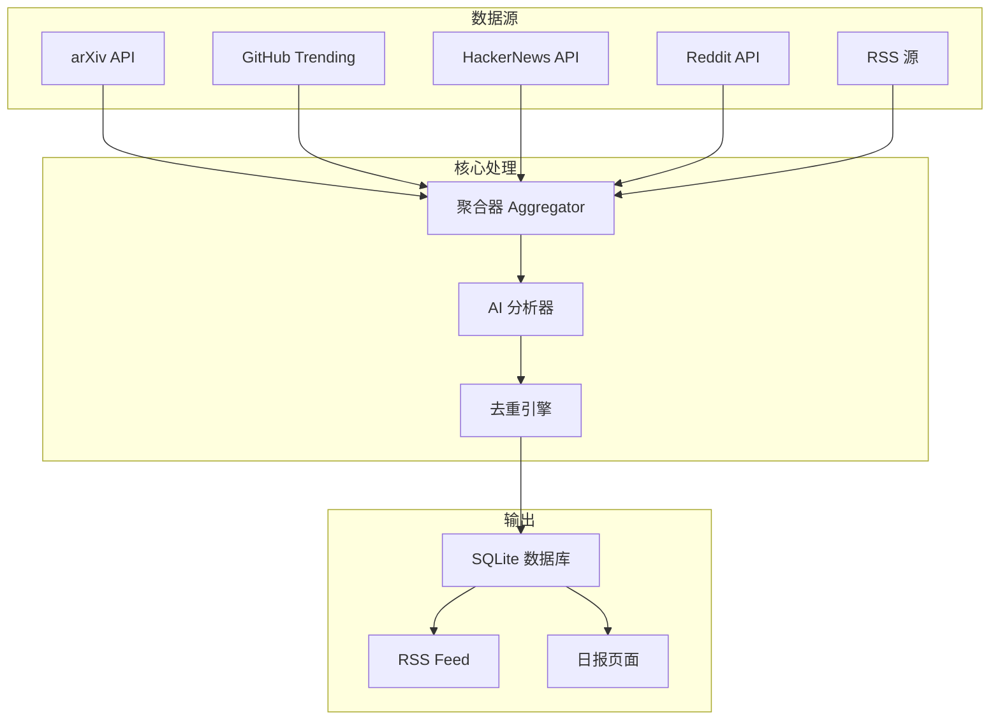
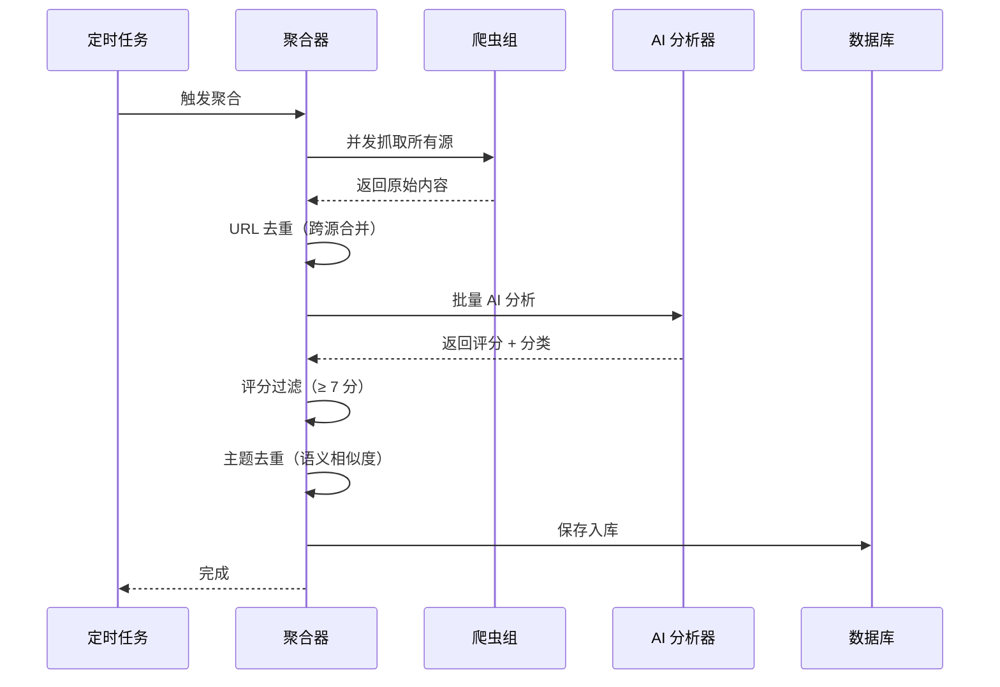
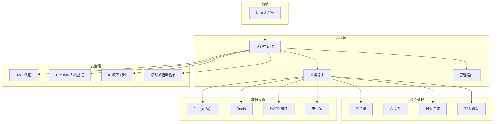

# 第 4 章：架构设计

---

## 开源版架构

开源版的架构非常简单 — 这是有意为之。MVP 阶段架构越简单越好调试。

### 整体数据流



### 目录结构

```
ai-news-rss/
├── app.py                 # 入口：FastAPI 应用 + 定时任务
├── backend/
│   ├── core/
│   │   ├── aggregator.py  # 核心：聚合调度
│   │   ├── news_poller.py # 定时触发
│   │   ├── ai/
│   │   │   ├── client.py  # GLM API 客户端
│   │   │   └── analyzer.py # AI 评分/分类
│   │   └── scrapers/
│   │       ├── base.py    # 爬虫基类
│   │       ├── hackernews.py
│   │       ├── reddit.py
│   │       ├── github.py
│   │       ├── arxiv_api.py
│   │       └── rss.py
│   ├── models/
│   │   ├── database.py    # 数据库初始化
│   │   └── ai_news.py    # 数据模型
│   └── routes/
│       ├── rss.py         # RSS 输出
│       ├── daily.py       # 日报 API
│       └── news.py        # 新闻查询
├── static/                # 静态 HTML 页面
└── requirements.txt
```

**设计原则：每个模块只做一件事。**

- `scrapers/` — 只管抓取，不管评分
- `ai/` — 只管分析，不管存储
- `aggregator.py` — 只管调度，把上面的串起来
- `routes/` — 只管对外暴露 API

---

## 核心处理流程

聚合器（Aggregator）是整个系统的调度中心，每次执行的流程：



**关键设计决策：**

1. **并发抓取** — 5 个信息源用 `asyncio.gather()` 同时抓，互不阻塞
2. **两层去重** — 先按 URL 去重（精确），再按主题语义去重（模糊）
3. **AI 批量处理** — 不是一条一条分析，而是批量发给模型，省 API 调用次数

---

## 去重机制

去重是这个系统里最容易被低估的部分。同一条新闻可能同时出现在 HackerNews、Reddit 和 RSS 里：

### 第一层：URL 去重

```
标准化 URL → 去掉 www/协议/末尾斜杠 → 同 URL 合并
```

简单粗暴，但能去掉 60% 以上的重复。

### 第二层：主题语义去重

URL 不同但讲同一件事的情况（比如一条 Reddit 帖子和一篇 RSS 博客讨论同一个 AI 模型发布）：

- 标题分词计算相似度
- AI 标签重叠度
- 关键实体（公司名/产品名）匹配

三个条件满足任一即视为重复，保留评分更高的那条。

---

## SaaS 版架构扩展

SaaS 版在开源版基础上加了一整层：



**核心变化：**

| 维度 | 开源版 | SaaS 版 |
|------|--------|---------|
| 入口 | 单 `app.py` | 前后端分离 |
| 认证 | 无 | JWT + 中间件 |
| 数据库 | SQLite 单文件 | PostgreSQL + 连接池 |
| 缓存 | 无 | Redis（限流/Session）|
| 内容分发 | RSS only | RSS + 邮件 + 语音 + Web |
| 部署 | Docker 单容器 | 1Panel 多服务编排 |

---

## 架构演进思路

这个演进过程本身就是方法论的体现：

**1. 先跑通再优化**

开源版用 SQLite、单文件入口、没有认证 — 能跑就行。验证了核心逻辑有效之后，再考虑扩展。

**2. 按需升级，不超前设计**

不是一开始就规划 PostgreSQL + Redis，而是用户量/功能需求到了才升级。

**3. 保持核心不变**

注意看：聚合器的核心逻辑（抓取 → AI 分析 → 去重 → 存储）在两个版本里是一样的。SaaS 版只是在外面包了一层用户和权限。

