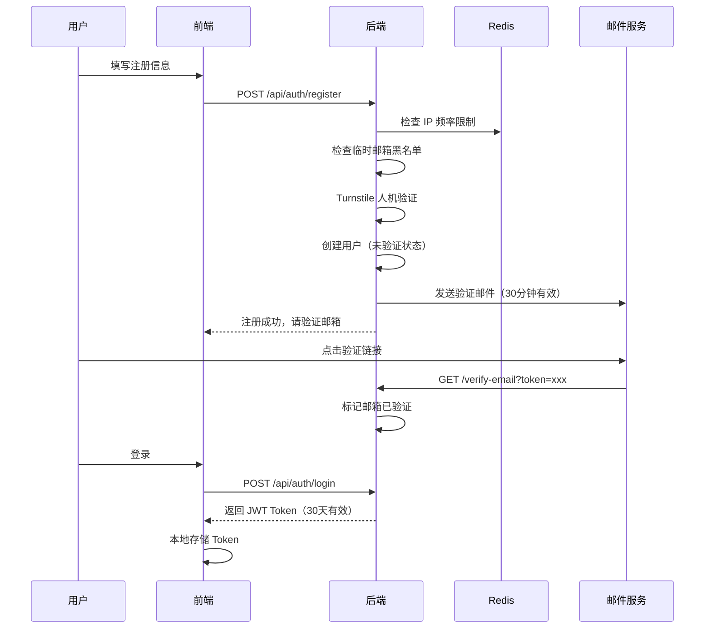

# 第 9 章：用户体系

---

## 要做什么

产品要给别人用了，就需要"知道谁是谁"。用户体系需要处理：

- **注册** — 创建账号
- **登录** — 验证身份，发令牌
- **认证** — 后续每个请求证明"我是某人"
- **邮箱验证** — 确认邮箱是真的（防垃圾注册）

---

## 整体流程

注册时一次性做了 4 层检查（IP 限频、邮箱黑名单、Turnstile、邮箱归一化），这些防护手段在第 11 章详细讲。

---

## 认证方案：JWT

选 JWT 而不是 Session 的原因：

- **无状态** — 不需要服务端存 session，重启也不丢
- **前后端分离友好** — Token 存前端 localStorage，每次请求带上 Authorization header
- **性能好** — 验证只需要解密签名，不用查数据库

Token 有效期 30 天。新闻订阅类产品不需要频繁重登录 — 用户每天来看看日报，不想每次都输密码。

密码用 bcrypt 哈希存储，源码里用 `passlib` 库的 `CryptContext`。

---

## 邮箱验证

为什么要验证邮箱？

1. **确认真实性** — 防止随便填个邮箱注册
2. **通知渠道** — 后续邮件推送依赖真实邮箱
3. **增加注册成本** — 薅羊毛的人要额外操作一步

实现方式：注册时生成一个随机 token（`secrets.token_urlsafe(32)`），拼成链接发到邮箱。用户点击后标记验证完成。token 30 分钟过期（`VERIFY_TOKEN_EXPIRE_SECONDS = 1800`）。

---

## 套餐体系

源码中 `User.PLAN_LIMITS` 定义了三档套餐：

| 套餐 | 价格 | 内容展示 | 可用功能 |
|------|------|----------|----------|
| 免费 | 0 | 每板块 40% 内容（至少 1 条）| Web + RSS |
| 基础 | 9.9/月 或 99/年 | 全部内容 | + 邮件推送 |
| 专业 | 19.9/月 或 199/年 | 全部内容 | + 语音播报 |

**设计思路：** 不是"功能阉割"，是"内容分级"。免费用户能看到所有板块，只是每个板块展示的条数少（`content_ratio: 0.4`）。

这样做的好处：
- 免费用户能体验到完整产品形态，知道付费后会得到什么
- 用 `content_ratio` 参数控制比例，信息源增加时不需要改权限逻辑
- 不需要维护两套模板/页面

---

## 早鸟福利

上线初期设了 `EARLY_BIRD_TOTAL=20`（前 20 名注册送 30 天基础版）。

效果：
- 快速积累了第一批用户
- 降低了试用门槛
- 有人体验后转为付费

问题：
- 被人用临时邮箱批量注册薅福利了
- 这个问题催生了后续的防薅体系（第 11 章）

---

## 用户状态管理

源码中 `User` 模型除了基本信息外，还有几个关键字段：

- `plan_expire_at` — 套餐到期时间戳，过期自动降为免费
- `future_plan` — 降级延迟生效（当前高级套餐用完再切换）
- `risk_level` — 风控等级
- `banned_until` — 临时冻结到期时间
- `ban_reason` — 封禁原因（展示给用户看）

`effective_plan` 属性会综合判断：管理员直接返回 admin，非管理员检查到期时间，过期了返回 free。这样不需要定时任务去刷状态 — 每次查询时实时计算。

