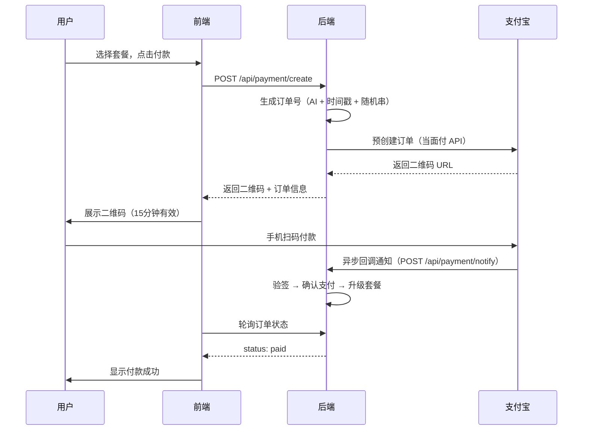

# 第 10 章：支付逻辑

---

## 为什么选支付宝当面付

个人开发者能接的支付方式不多：

| 方案 | 门槛 | 适合场景 |
|------|------|----------|
| 微信支付 | 需要企业资质 | 不可用 |
| 支付宝网页支付 | 需要企业资质 | 不可用 |
| **支付宝当面付** | 个人可申请 | 适合 |
| 第三方平台（爱发卡等）| 手续费高 | 备选 |

**支付宝当面付**是为线下扫码设计的，但完全可以用在线上 — 调 API 生成一个二维码 URL，前端展示成二维码图片，用户手机扫码付款。个人开发者可以直接申请开通，不需要企业认证。

---

## 支付流程



---

## 订单状态

源码中订单只有三个状态：

```
pending（待支付）→ paid（已支付）
                 → expired（15分钟超时未付）
```

简单够用。金额用**分**存储（整数），如 `990` 表示 9.90 元。这样避免浮点数精度问题 — 展示时再除以 100。

源码中具体价格（`PLAN_PRICES`）：
- 基础版：9.9/月，99/年
- 专业版：19.9/月，199/年

---

## 升级/续费/降级

这是支付里最复杂的部分 — 用户当前有套餐，买了新的怎么处理？

源码中 `_classify_intent` 函数判断操作意图：

| 意图 | 判断条件 | 处理方式 |
|------|----------|----------|
| 续费 | 免费用户 / 同套餐 / 已过期 | 在现有到期时间上累加天数 |
| 升级 | 买了更高级的套餐 | 立即生效，从现在开始算新的到期时间 |
| 降级 | 买了更低的套餐 | **延迟生效**，等当前套餐到期再切换 |

**降级为什么不立即生效？**

用户已经为当前高级套餐付过钱了。如果立即降级，相当于白白浪费了剩余天数。所以设了 `future_plan` 和 `future_plan_start_at` 字段 — 记录"到期后要切换成什么"。

这个设计参考的 WeChat RSS 项目 — 那边先踩过这个坑，用户投诉"我升级后能用的时间变少了"，所以后来做了延迟降级。

---

## 支付宝回调

支付成功后支付宝会主动调你的回调 URL，三件事必须做对：

1. **验签** — 用支付宝公钥验证请求签名，确认是支付宝发来的而不是伪造的
2. **幂等** — 同一笔订单可能回调多次（网络重试），已处理的直接返回 "success" 不要重复操作
3. **返回 "success"** — 告诉支付宝你收到了，否则它会每隔一段时间重新发，连续发好几天

源码中回调处理的核心逻辑：

```
验签失败 → 返回 "fail"
订单不存在 → 返回 "success"（告诉支付宝别再发了）
已支付 → 返回 "success"（幂等）
待支付 → 执行 fulfill（升级套餐）→ 返回 "success"
```

---

## 踩坑经验

### 回调 URL 必须公网可达

本地开发时支付宝的回调送不到你机器上。解决方案：
- 用 `ngrok` 临时暴露本地端口
- 或者直接在测试服务器上调试

### 沙箱环境不靠谱

支付宝有沙箱（测试环境），但经常和正式环境行为不一致。我后来直接用正式环境小额测试 — 创建 0.01 元的订单，扫码付一分钱验证流程。

### 密钥管理

支付宝接口用 RSA2 签名。需要两把钥匙：
- **应用私钥** — 自己生成，发请求时签名用
- **支付宝公钥** — 验证回调签名用

这两个绝对不能提交到代码仓库。放环境变量，`.env` 文件加入 `.gitignore`。

### 前端轮询

用户扫码后，前端怎么知道付没付？两种方式：
- WebSocket（实时，但实现复杂）
- **轮询**（每 2 秒查一次订单状态，简单粗暴）

源码用的轮询。对个人项目来说完全够了。

