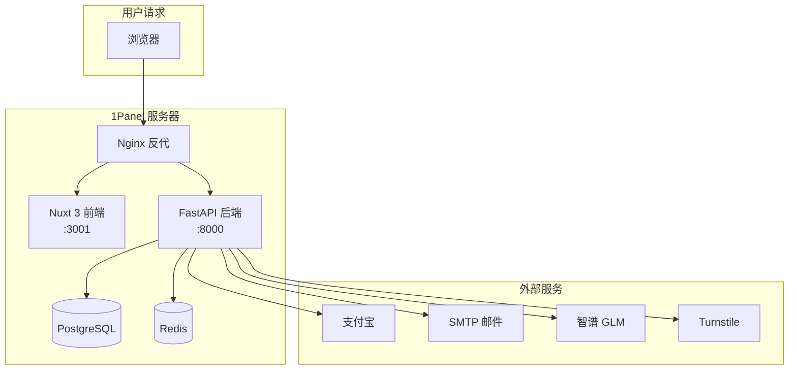

# 第 12 章：SaaS 部署上线

---

## 部署架构

SaaS 版不再是单容器，需要多个服务协同工作：

---

## 为什么用 1Panel 而不是裸 Docker

选 1Panel 做服务器管理：

- **可视化** — 不用每次 SSH 上去操作，有 Web 面板
- **Nginx 管理** — 添加域名、配 SSL、设反代规则，点几下就行
- **数据库管理** — PostgreSQL 和 Redis 一键安装，自带监控
- **定时备份** — 设个计划任务自动备份数据库
- **文件管理** — 在线编辑配置文件

个人开发者的时间有限，省运维时间 > 技术纯粹性。用 K8s 部署一个月收入百元的产品，纯属浪费生命。

---

## 域名和 SSL

部署上线需要处理的网络层配置：

1. **域名购买** — 在域名商那里买一个（或用子域名）
2. **DNS 解析** — 添加 A 记录，指向服务器公网 IP
3. **SSL 证书** — 1Panel 自带 Let's Encrypt 自动申请 + 自动续签（免费）
4. **Nginx 反代** — 根据 URL 路径把请求分发到前端或后端

Nginx 配置的核心逻辑：
- `/` 走 Nuxt 前端（端口 3001）
- `/api` 走 FastAPI 后端（端口 8000）
- 静态资源走 Nginx 自己处理

---

## 前后端分离部署

### 后端（FastAPI）

直接跑在服务器上（不套 Docker），用 systemd 管理进程：

- 优点：方便调试、看日志方便、改代码立刻生效
- systemd 配置：崩溃自动重启（`Restart=always`）

### 前端（Nuxt 3）

SSR 模式运行（Server-Side Rendering）：

- `npm run build` 构建
- `node .output/server/index.mjs` 启动
- 好处：首屏加载快、SEO 友好

### 为什么不用 Docker

SaaS 版没用 Docker 部署的原因：
- 开发阶段频繁改代码，Docker 重新 build 太慢
- 1Panel 已经管理了 PostgreSQL 和 Redis 的容器
- 直接跑方便看日志和调试
- 后续稳定了可以再容器化

---

## 环境变量管理

所有敏感配置走环境变量（`.env` 文件），不提交代码仓库。SaaS 版需要配置的东西比开源版多很多：

**必须配置：**
- `JWT_SECRET` — 认证签名密钥
- `DATABASE_URL` — PostgreSQL 连接串
- `REDIS_URL` — Redis 地址
- `GLM_API_KEY` — AI 模型 Key
- `SITE_URL` — 前端域名（用于拼验证邮件链接）

**支付相关：**
- `ALIPAY_APP_ID` — 应用 ID
- `ALIPAY_PRIVATE_KEY` — 应用私钥
- `ALIPAY_PUBLIC_KEY` — 支付宝公钥
- `ALIPAY_NOTIFY_URL` — 回调地址

**邮件/安全：**
- `SMTP_HOST` / `SMTP_USER` / `SMTP_PASSWORD` — 邮件发送
- `TURNSTILE_SECRET` — 人机验证密钥

总共 15+ 个环境变量。用 `.env.example` 记录所有配置项及说明。

---

## 上线前检查清单

每次部署或更新后逐项确认：

- [ ] 域名解析生效（ping 能通）
- [ ] SSL 证书正常（浏览器地址栏有锁）
- [ ] 后端健康检查通过（`curl /api/health` 返回 200）
- [ ] 数据库连接正常（新建用户能成功）
- [ ] Redis 连接正常（频率限制生效）
- [ ] 支付宝回调 URL 正确（小额测试付款能到账）
- [ ] 邮件能发出去（注册能收到验证邮件）
- [ ] CORS 配置正确（前端能正常调后端）
- [ ] 定时聚合在跑（凌晨 4 点有新闻入库）
- [ ] 定时分发在跑（早上 8 点日报能生成）

---

## 踩坑经验

### CORS

前后端分离最常见的坑。后端必须明确允许前端域名，不能用 `*`（因为带 credentials 的请求不允许 `*`）。

### 支付回调路径

支付宝回调的 URL 必须是公网地址，并且路径要和 Nginx 反代规则匹配。`/api/payment/notify` 要能到达后端的 `/payment/notify` 路由。

### 时区问题

服务器默认 UTC，用户在中国（UTC+8）。源码里有个 `CST = timezone(timedelta(hours=8))` 和 `now_cst()` 工具函数。

规则：数据库统一存 UTC 时间戳（整数），展示给用户时再转北京时间。日报生成时间、订单创建时间等都遵循这个原则。

### 首次部署的顺序

正确的启动顺序：
1. 先启动 PostgreSQL 和 Redis
2. 后端启动（会自动建表）
3. 前端启动
4. Nginx 配好反代
5. 测试注册→登录→付款完整流程

颠倒顺序会遇到各种"连接被拒绝"的报错。

